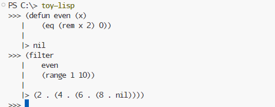

## Toy LISP dialect

Yet another lisp interpreter

Inspired by [Liutos](https://github.com/Liutos/Camel-Lisp)




### Run tests

```sh
dotnet test
```

### How to use


1) using *dotnet run*

```sh
$ dotnet run --project .\Cl.Utop\Cl.Utop.csproj
```

2) using *dotnet tool*

#### Install *toy-lisp*

```sh
$ dotnet pack -c Release
$ dotnet tool install --global --add-source ./Cl.Utop/nupkg toy-lisp
$ where toy-lisp
```

#### Run *toy-lisp*

```sh
$ toy-lisp
```

#### Uninstall *toy-lisp*

```sh
$ dotnet tool uninstall toy-lisp -g
$ dotnet tool list -g
```

By default REPL loads the [stdlib](./stdlib) file so you can use predefined functions written in toy lisp.

### Hello World

```clojure
(define hello-world 'Hello World!')
(println hello-world)
```

In case you want more [examples](./examples.md)
